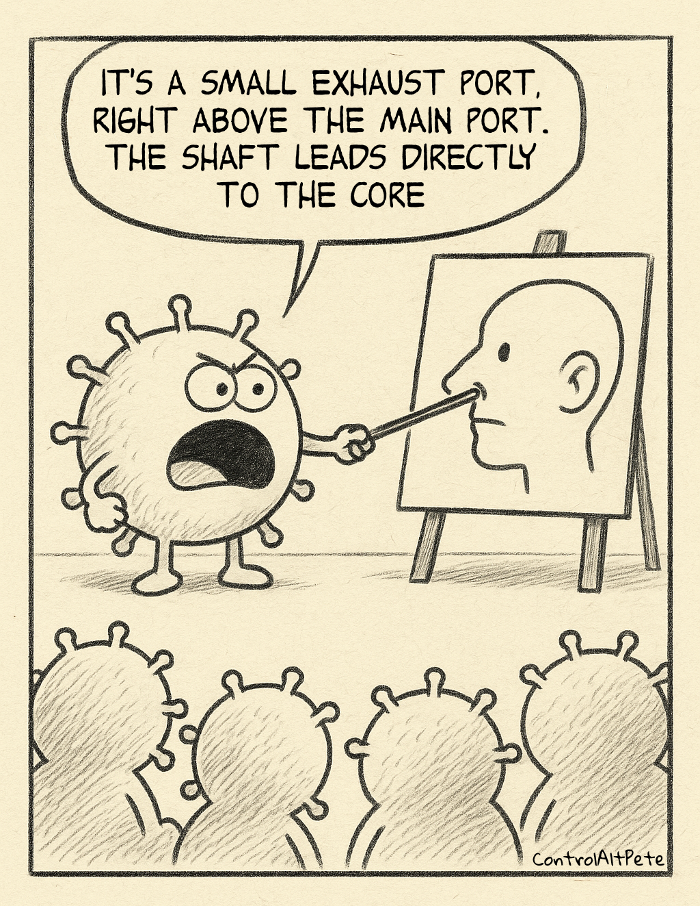
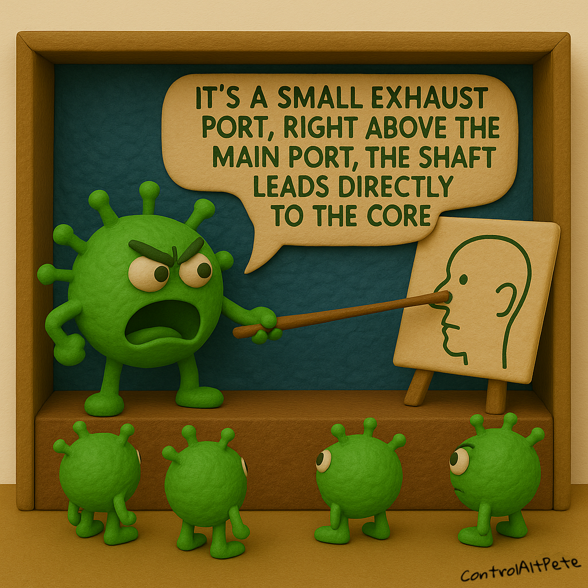
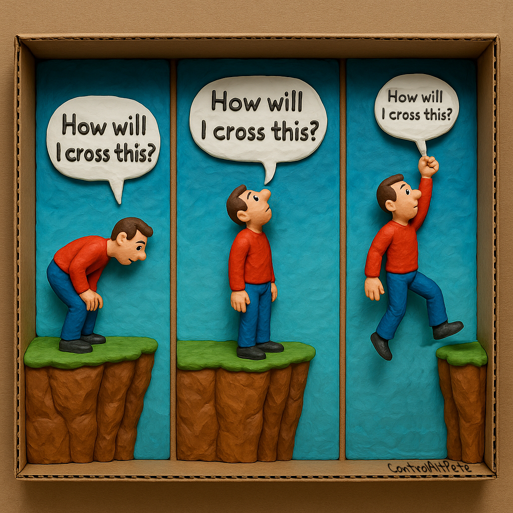
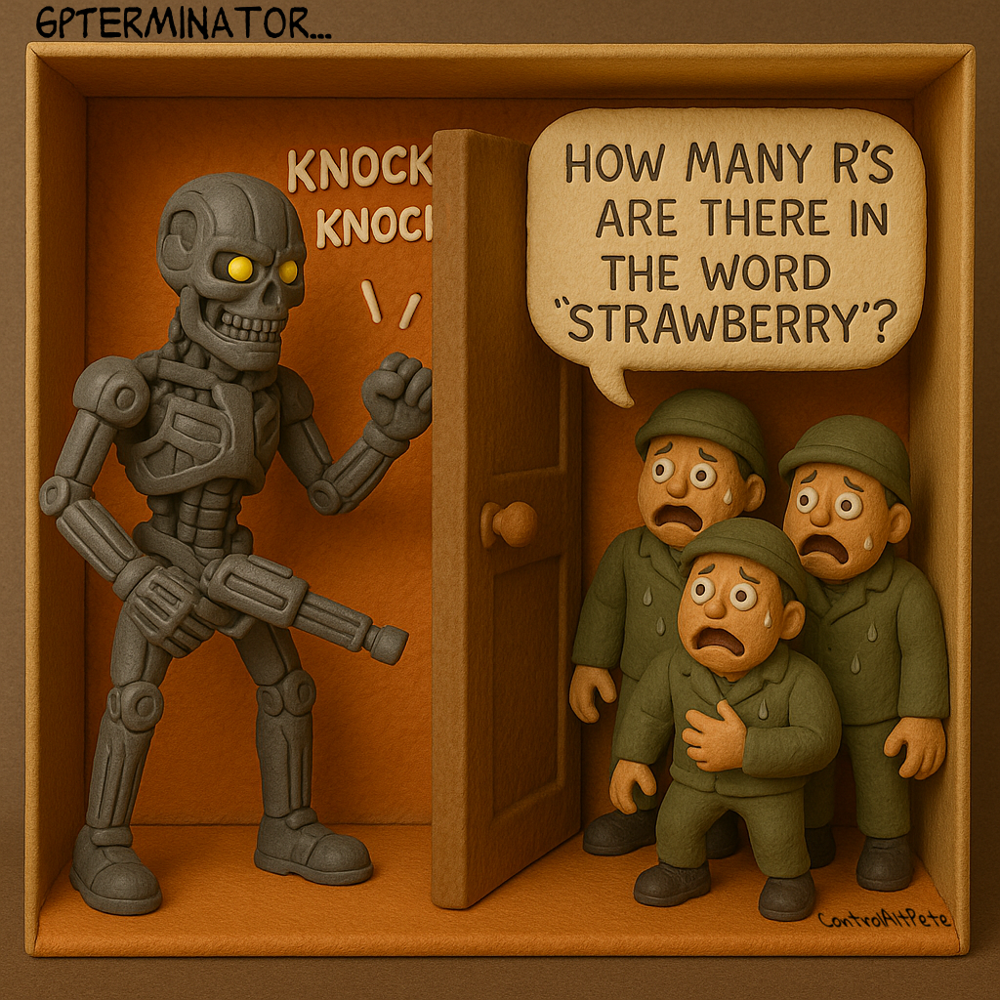
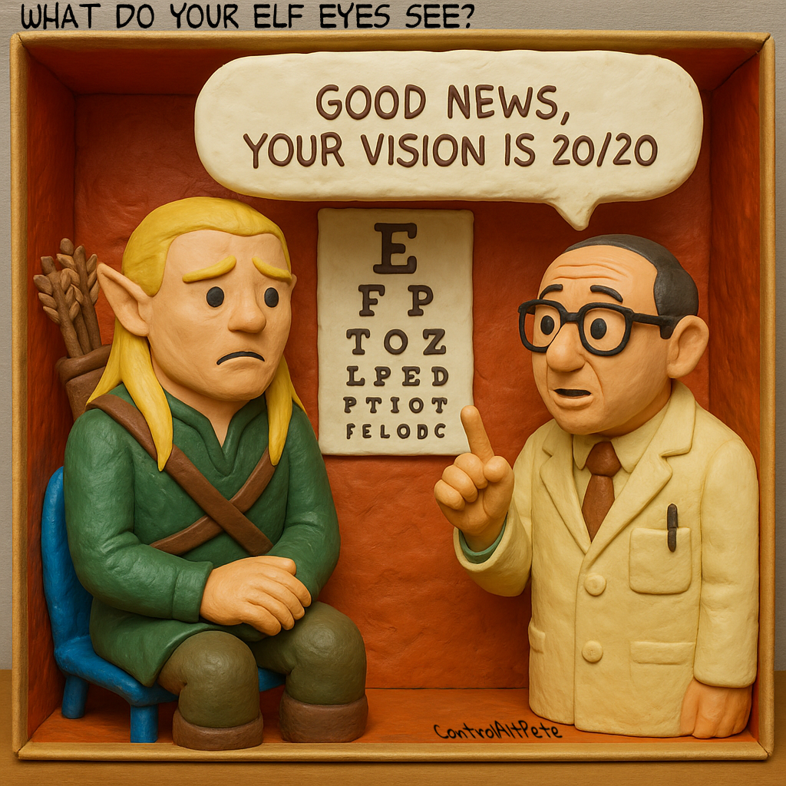
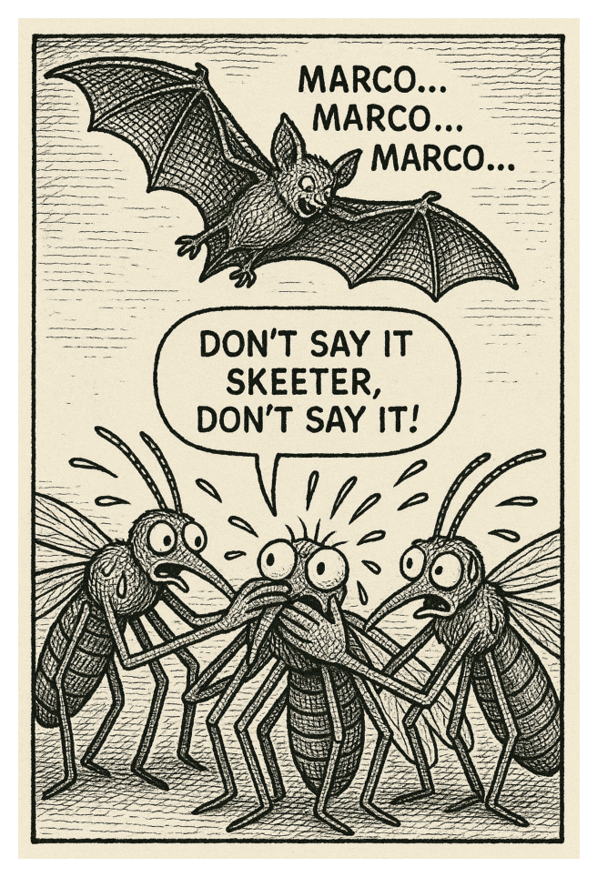
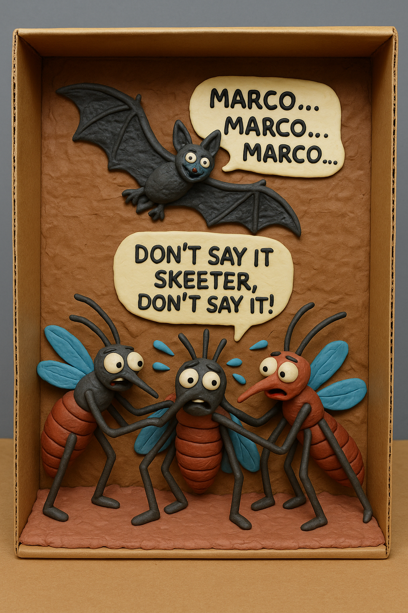
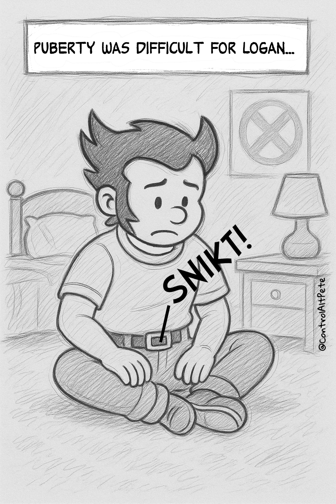
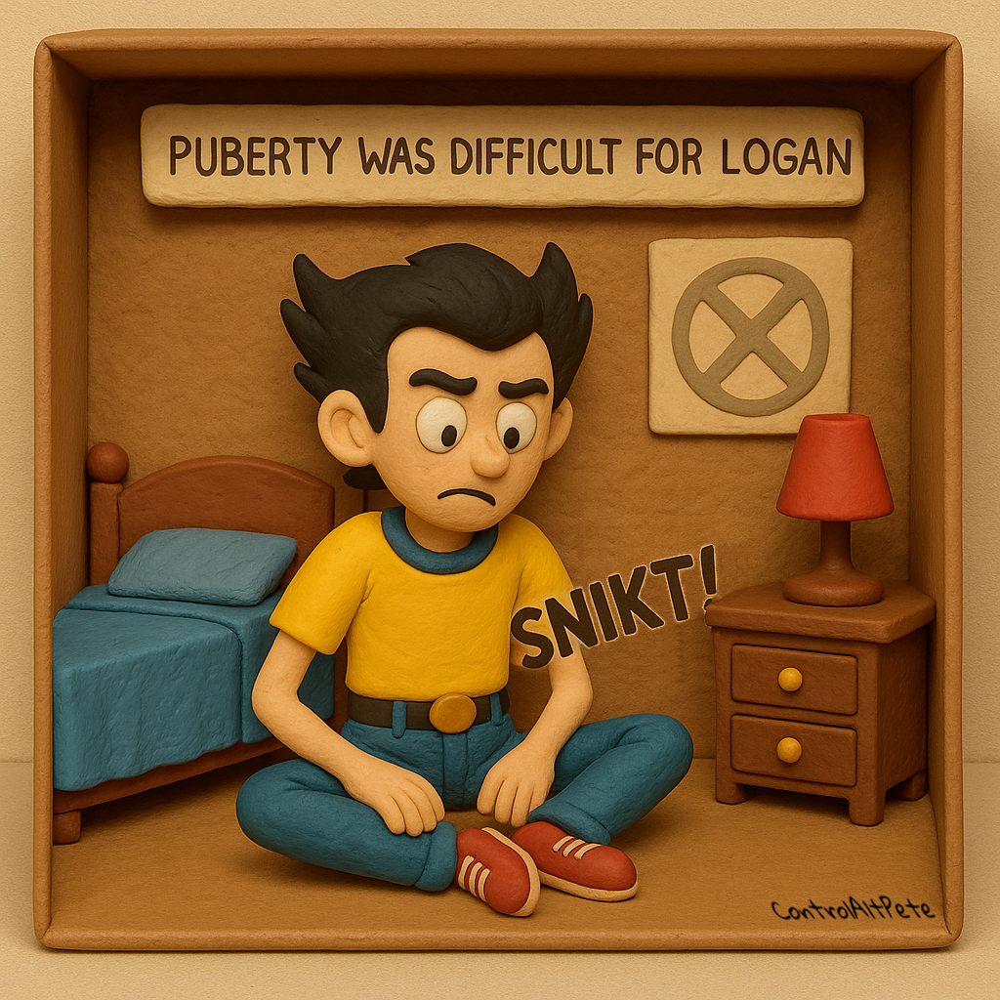
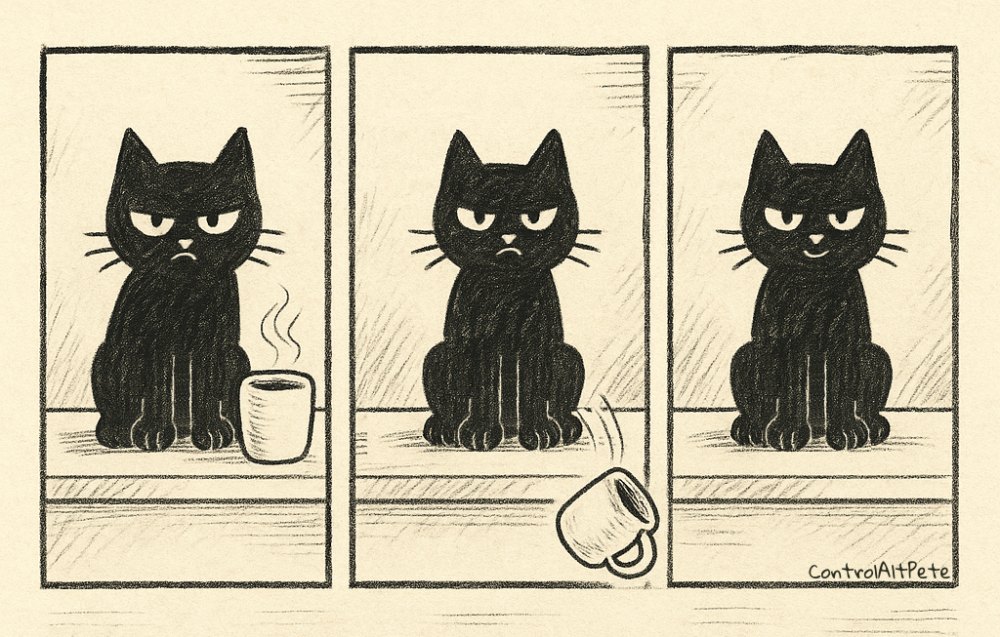

I occasionally make cartoons.

<!--more-->

  

    
    
    
  

  

    
    
  

  
  

    
    
  

  

    
    
  

  

    
    
  

  

    
    
  

  

    
    
  

  

    
    
  

  

    
  

</body>
</html>

